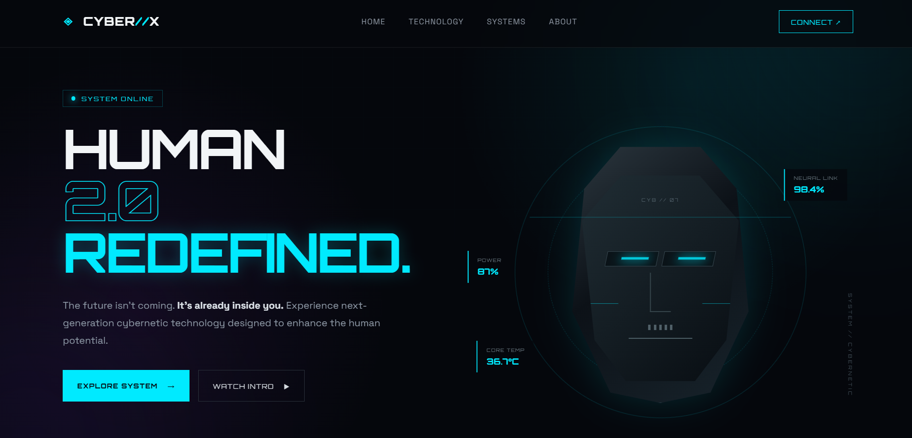

# ⚡ CYBER//X — Human 2.0

> **The future isn't coming. It's already inside you.**

CYBER//X is a futuristic, cyberpunk-inspired landing page that explores the concept of **Human 2.0** — a world where biological intelligence meets advanced cybernetic technology.

The website combines immersive visuals, futuristic typography, glowing UI elements, system-style interfaces, animations, and responsive layouts to create a next-generation digital experience.

---

## 🚀 Live Demo

https://gauri9368gupta-maker.github.io/Techfest--IIT-Bombay/Task1/cyborg.html?utm_source=chatgpt.com

---

## 📸 Preview




---

## ✨ Features

- 🧬 Futuristic **Human 2.0** cybernetic theme
- 🌐 Responsive landing page design
- ⚡ Interactive navigation
- 💻 Cyberpunk-inspired UI/UX
- 🟢 Animated **System Online** status
- 🧠 Neural Link interface
- 🔋 Cyber Core system visualization
- 👁️ Vision AI feature section
- 🦾 Synthetic skin technology section
- 📊 Animated system performance indicators
- 🎯 Interactive CTA sections
- 📡 Futuristic scrolling ticker
- ✨ Glow, grid, scan-line, and HUD effects
- 📱 Mobile-friendly responsive layout

---

## 🧠 Website Sections

### 01 — Hero Section

Introduces the CYBER//X concept with:

- System status indicator
- Human 2.0 headline
- Cybernetic technology description
- Explore System CTA
- Watch Intro CTA
- Performance statistics
- Futuristic cyborg interface

---

### 02 — Technology

Showcases the core CYBER//X technologies:

| Technology | Description |
|---|---|
| 🧠 Neural Link | Direct interface between neural networks and intelligent systems |
| ⚙️ Cyber Core | High-performance synthetic energy system |
| 👁️ Vision AI | Enhanced perception powered by machine intelligence |
| ◈ Synth Skin | Adaptive synthetic material responding to environmental conditions |

---

### 03 — System Architecture

Visualizes the internal CYBER//X system using:

- Core energy indicator
- Orbital rings
- Neural processing percentage
- Motor response percentage
- Vision processing percentage
- Futuristic system visualization

---

### 04 — System Upgrade CTA

A final call-to-action asking:

> **ARE YOU READY TO UPGRADE?**

Designed to reinforce the futuristic theme and encourage user interaction.

---

## 🛠️ Tech Stack

- **HTML5** — Semantic page structure
- **CSS3** — Styling, responsive design, animations, and visual effects
- **JavaScript** — Interactive behavior and dynamic UI
- **CSS Animations** — Glowing effects, scanning elements, transitions, and system interactions

---

## 📁 Project Structure

```text
CYBER-X/
│
├── index.html
├── style.css
├── script.js
├── preview.png
└── README.md
