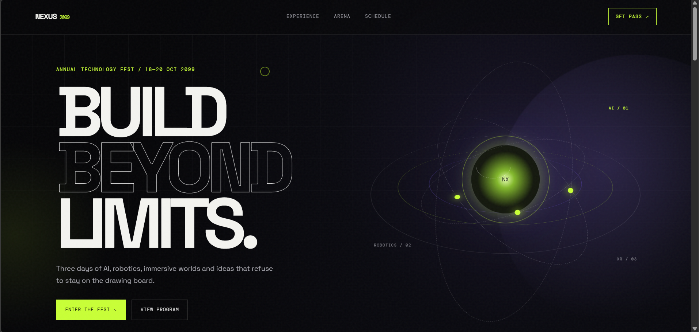
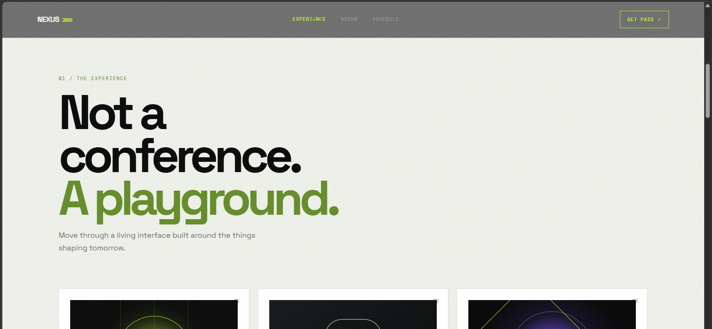
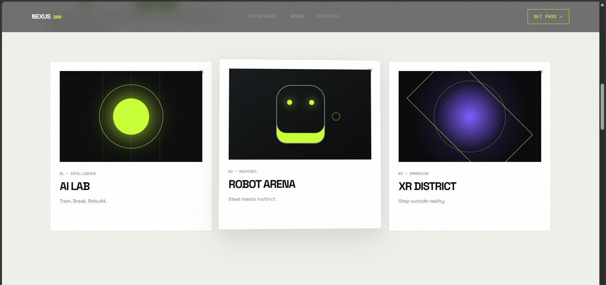
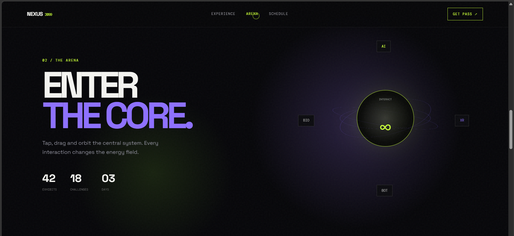
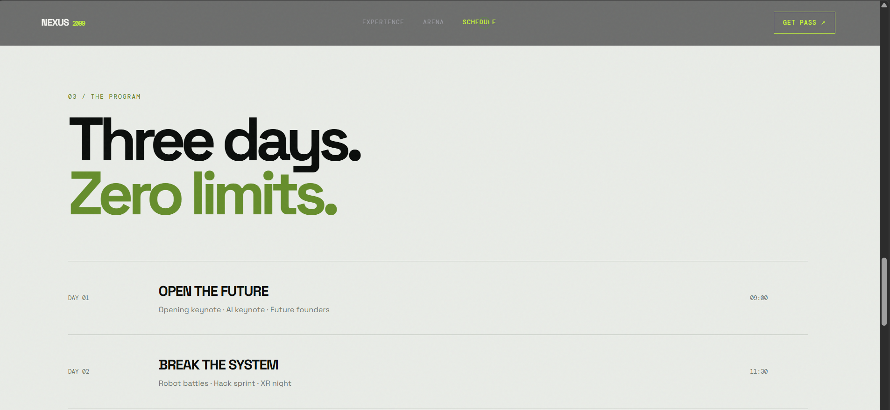
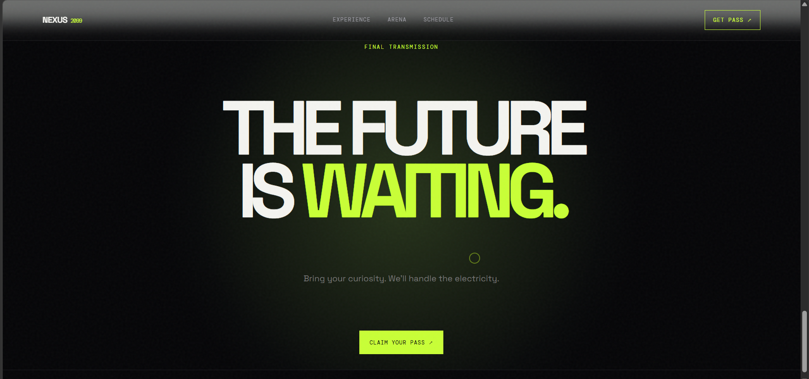

# NEXUS 2099 — TechFest 🚀

A futuristic and immersive **TechFest landing page** built around the theme **“Build Beyond Limits.”** The website combines a cyberpunk-inspired visual style with interactive UI elements, animations, glowing effects, and smooth navigation.

## Live Link
https://gauri9368gupta-maker.github.io/Techfest--IIT-Bombay/Task2/?utm_source=chatgpt.com

## Preview 







## 🌐 Overview

**NEXUS 2099** is a fictional next-generation technology festival focused on **AI, Robotics, XR, and emerging technologies**.

The website is designed as an interactive digital experience rather than a traditional event website, featuring futuristic visuals, animated elements, interactive cards, an energy-core interface, and a modern responsive layout.

## ✨ Features

- 🎬 Animated loading screen
- 🧭 Sticky navigation bar
- 🌌 Futuristic hero section
- 🌀 Animated orbital core visual
- 🤖 AI Lab, Robot Arena & XR District cards
- ⚡ Interactive technology core
- 📅 Three-day event schedule
- 🎟️ Interactive pass registration
- 🖱️ Custom cursor effects
- ✨ Glowing background effects
- 🎨 Hover and tilt animations
- 📱 Responsive design
- 🔗 Smooth section navigation
- 💻 Built with pure HTML, CSS & JavaScript

## 🛠️ Tech Stack

- **HTML5** — Page structure and semantic sections
- **CSS3** — Styling, animations, layouts, gradients, and responsive design
- **JavaScript** — User interactions, animations, scrolling, and registration functionality

## 📂 Project Structure

```text
NEXUS-2099/
│
├── index.html      # Main webpage
├── style.css       # Styling, animations and responsive design
├── script.js       # Interactive functionality
└── README.md       # Project documentation
