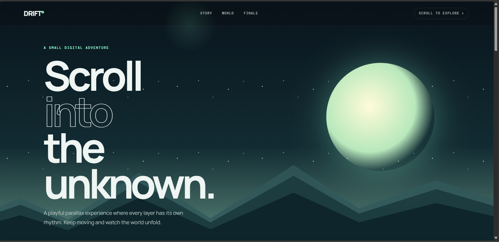
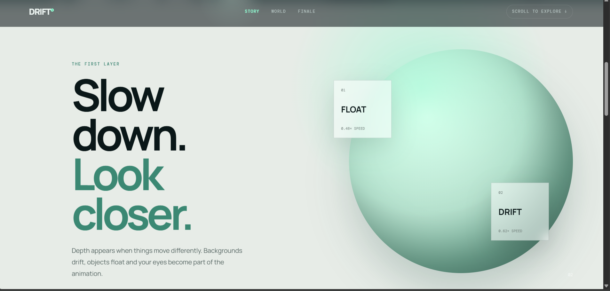
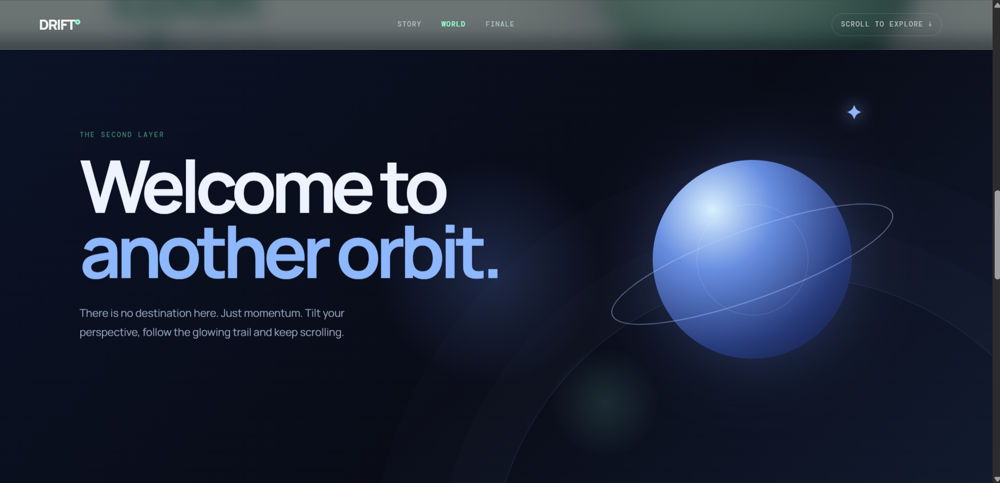
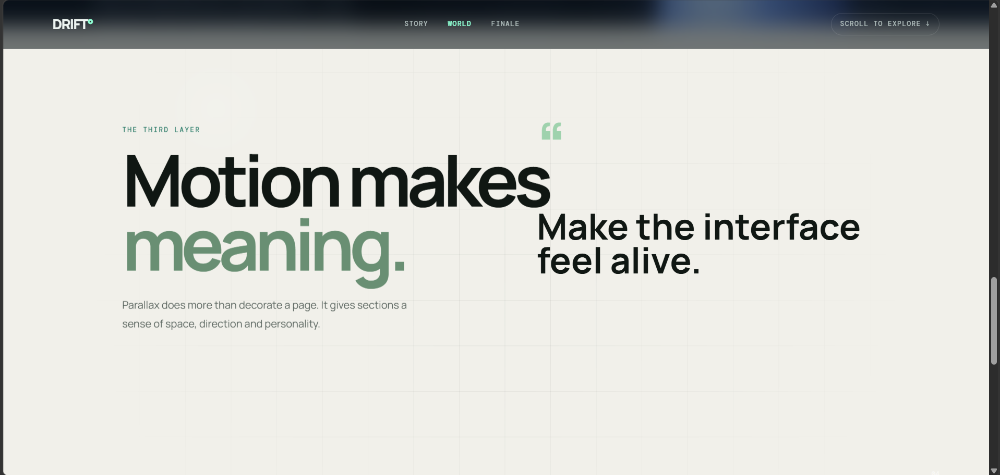
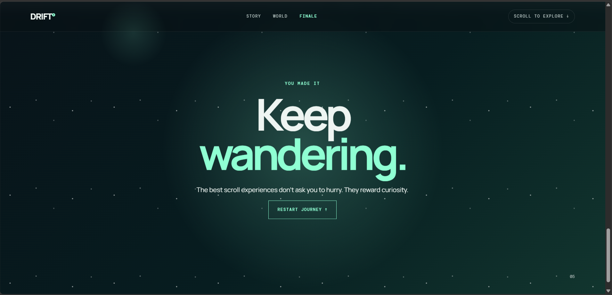

# 🌌 DRIFT° — A Parallax Journey

> **Scroll into the unknown.**

DRIFT° is an immersive **parallax scrolling web experience** designed around the idea of turning a simple webpage into a visual journey. Each section uses layered movement, floating elements, glowing effects, and smooth interactions to create depth and motion as the user scrolls.

## Live Link
https://gauri9368gupta-maker.github.io/Techfest--IIT-Bombay/Task3/?utm_source=chatgpt.com

## Preview






## ✨ Features

- 🌌 Immersive parallax scrolling
- 🏔️ Multi-layer mountain landscape
- ⭐ Animated star backgrounds
- ☀️ Glowing sun effects
- 🪐 Futuristic planet and orbital animations
- ✦ Floating and drifting elements
- 🖱️ Custom cursor glow
- 📜 Smooth navigation between sections
- 🎨 Modern and minimal visual design
- 📱 Responsive layout
- 🔄 Restart journey interaction
- ⚡ Lightweight implementation using vanilla web technologies

## 🧭 Website Sections

### 01 — Hero

The journey begins with a layered landscape containing:

- Animated stars
- Mountains at different depths
- Glowing sun
- Introductory content
- Begin CTA
- Scroll indicator

> **Scroll into the unknown.**

### 02 — Story

The first layer introduces the concept of depth through different movement speeds.

It includes:

- Floating orb
- Parallax text
- Floating cards
- Interactive visual elements

> **Slow down. Look closer.**

### 03 — World

The experience moves into a futuristic orbital environment featuring:

- Planet visualization
- Orbital rings
- Satellite element
- Glowing backgrounds
- Multiple parallax layers

> **Welcome to another orbit.**

### 04 — Reveal

This section demonstrates how motion can enhance storytelling and make an interface feel more alive.

> **Motion makes meaning.**

### 05 — Finale

The journey ends with a simple message encouraging exploration:

> **Keep wandering.**

Users can click **Restart Journey** to return to the beginning.

## 🛠️ Tech Stack

- **HTML5** — Structure and semantic content
- **CSS3** — Styling, layouts, animations, gradients, and visual effects
- **JavaScript** — Parallax effects, cursor interactions, and dynamic behavior

No external frameworks are required.

## 📂 Project Structure

```text
DRIFT/
│
├── index.html      # Main webpage
├── style.css       # Styling and animations
├── script.js       # Interactive functionality
├── images/         # Project images/assets
└── README.md       # Project documentation
