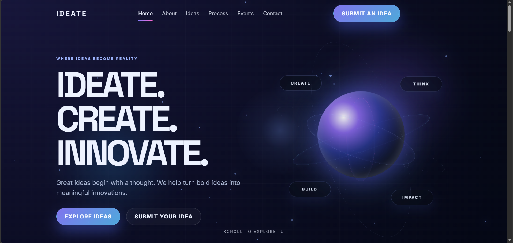
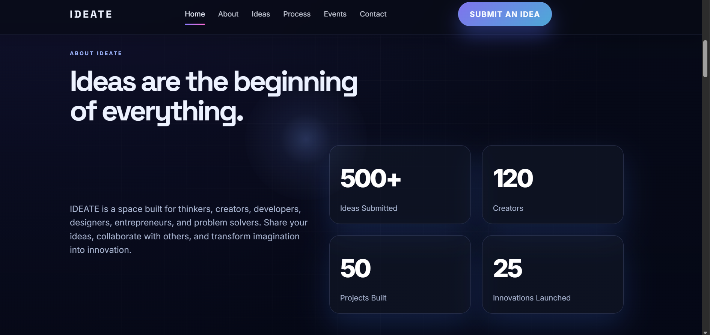
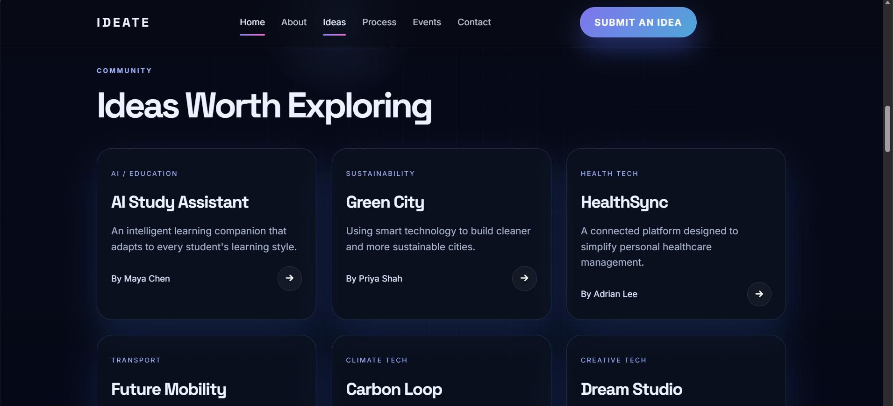
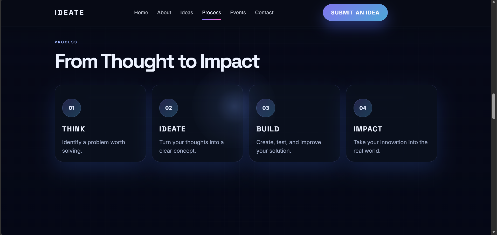
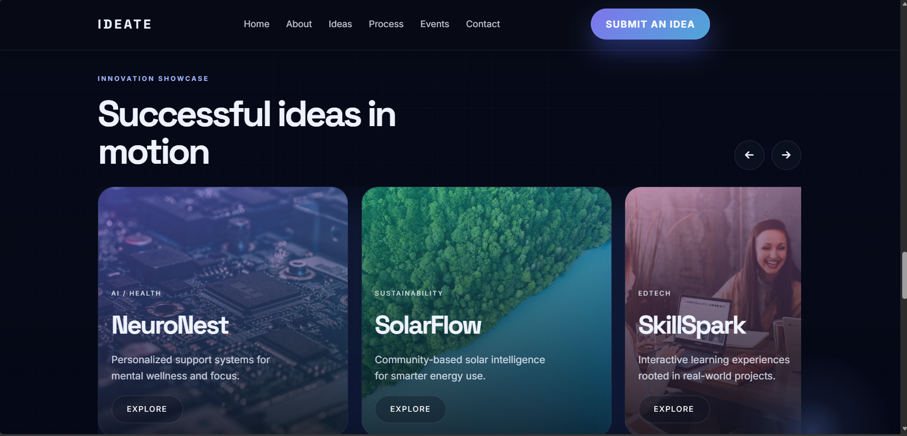
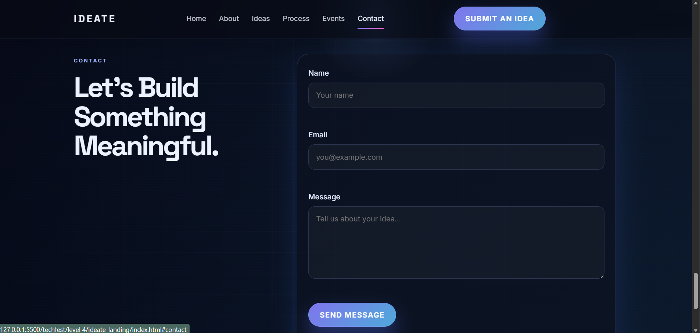

# 💡 IDEATE — Where Ideas Become Reality

> **Think. Create. Innovate.**

IDEATE is a modern and interactive **creative innovation platform** designed for thinkers, creators, developers, designers, entrepreneurs, and problem solvers.

The platform provides an engaging digital space to **explore innovative ideas, generate new concepts, discover projects, understand the innovation process, and submit ideas of your own.**

---

## 🌐 Live Demo

https://gauri9368gupta-maker.github.io/Techfest--IIT-Bombay/Task4/?utm_source=chatgpt.com

---

## 📸 Screenshots













> **Note:** Make sure the screenshot filenames above match the files inside your `images` folder. If your screenshots have different names, replace the paths accordingly.

---

## ✨ Features

- 🎨 Modern and responsive UI
- 💡 Community innovation showcase
- 🧠 Interactive idea generator
- 📊 Animated statistics counters
- 🔄 Interactive project carousel
- 📝 Idea submission/contact form
- ✅ Client-side form validation
- ✨ Scroll-based reveal animations
- 🖱️ Custom cursor glow
- 📱 Responsive mobile navigation
- 🔗 Smooth section navigation
- 🎯 Interactive buttons and cards
- 🌐 Google Fonts integration
- ⭐ Font Awesome icons
- ⚡ Smooth hover and transition effects

---

## 🧭 Website Sections

### 1. 🏠 Hero — IDEATE. CREATE. INNOVATE.

The landing section introduces the core purpose of IDEATE.

It includes:

- Main platform introduction
- Explore Ideas CTA
- Submit Your Idea CTA
- Animated innovation visual
- Scroll indicator

> **Great ideas begin with a thought. We help turn bold ideas into meaningful innovations.**

---

### 2. 📖 About IDEATE

The About section explains the vision of the platform and focuses on bringing together people who want to turn ideas into real-world solutions.

It includes animated platform statistics:

```text
500+  Ideas Submitted
120+  Creators
50+   Projects Built
25+   Innovations Launched
